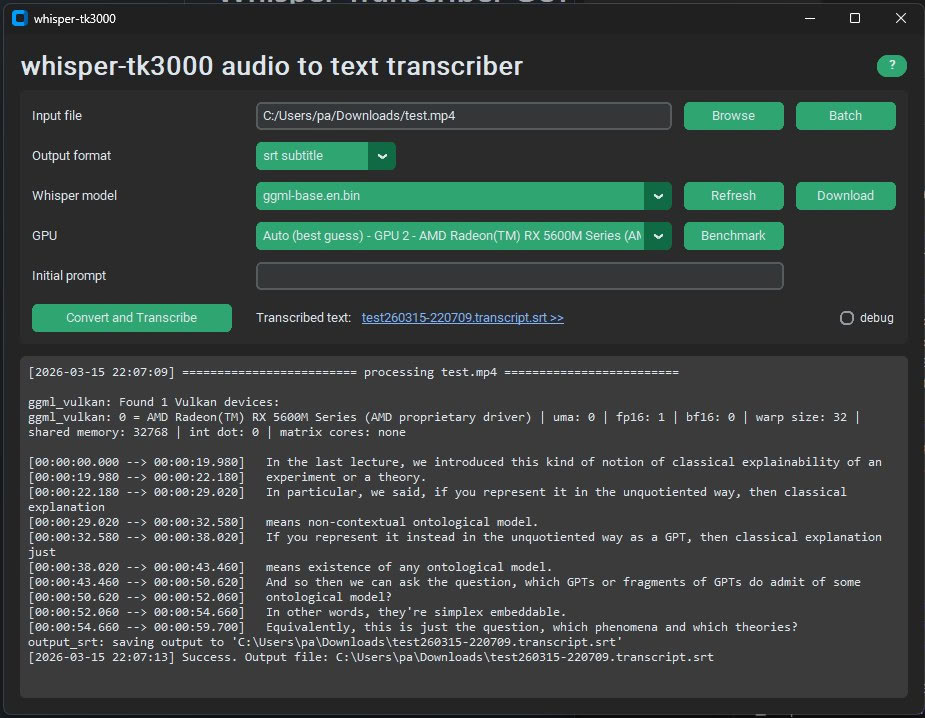

# Whisper Transcriber GUI

A simple desktop app for turning audio files into text. It runs entirely offline on your computer, so your files stay private.

It works on most Windows 10 and 11 machines. If a Vulkan-capable  GPU are available, transcription can run faster with GPU acceleration. Otherwise, it runs on the CPU.

## Features
- Transcribe common audio and video formats, including `.mp3`, `.wav`, `.m4a`, `.flac`, `.aac`, `.ogg`, `.webm`, `.mp4`, `.mkv`, `.mov`, and `.avi`.
- Process a single file or a selectable batch from a folder.
- Export transcripts as plain text (`.txt`) or subtitle files (`.srt`).
- Use an optional initial prompt to help with names, jargon, or context.
- Choose automatic GPU selection, a specific Vulkan GPU, or CPU-only execution.
- Fall back to CPU execution when Vulkan acceleration is unavailable.
- Run a built-in benchmark to compare available CPU and GPU backends on your machine.
- Download recommended Whisper models directly in the app.




## How to Get Started (No installation required!)

1. Go to our **[Download Page](https://github.com/taro-ball/whisper-tk3000/releases)**.
1. Download the latest `.zip` file for Windows.
1. Open the extracted folder and double-click the application .exe file to run it.

*That's it! You don't need to install Python, command-line tools, or any other software.*

## How to Use

1. Open the app.
1. Select your audio file.
1. Choose a transcription model (you can download one directly within the app if you haven't already).
1. Click **Transcribe**.

## Credits

- `whisper.cpp` for transcription:
  https://github.com/jerryshell/whisper.cpp-windows-vulkan-bin
- `ffmpeg` for media conversion:
  https://ffmpeg.org/about.html
- Model downloads from the `whisper.cpp` Hugging Face repository:
  https://huggingface.co/ggerganov/whisper.cpp/tree/main

---

## For Developers

*The following section is for software developers looking to build or modify the app.*

### Dependencies

- ffmpeg: `bin/ffmpeg.exe`
- whisper.cpp runtimes: `bin/whisper.cpu/whisper-cli.exe` and `bin/whisper.vulkan/whisper-cli.exe`
- Whisper models are not bundled into the PyInstaller build.
- Download a model from the app, or place a `.bin` file under `models/`.

### Run locally (PowerShell)

```powershell
python -m venv .venv
.\.venv\Scripts\python.exe -m pip install --upgrade pip
.\.venv\Scripts\python.exe -m pip install -r requirements.txt
.\.venv\Scripts\python.exe -m whisper_tk3000
```

### Tests

Fast default suite:

```powershell
.\.venv\Scripts\python.exe -m unittest discover -s tests
```

CPU smoke:

```powershell
$env:WHISPER_TK3000_RUN_SMOKE=1
.\.venv\Scripts\python.exe -m unittest discover -s tests
```

Vulkan smoke:

```powershell
$env:WHISPER_TK3000_RUN_VULKAN_SMOKE=1
.\.venv\Scripts\python.exe -m unittest discover -s tests
```

### Build (canonical Windows workflow)

```powershell
.\build.ps1
```

`build.ps1` is the canonical build entry point for this repository.

### Optional Git Bash wrapper

If you intentionally use Git Bash on Windows, `build.sh` is a thin wrapper around `build.ps1`.

```bash
./build.sh
```
